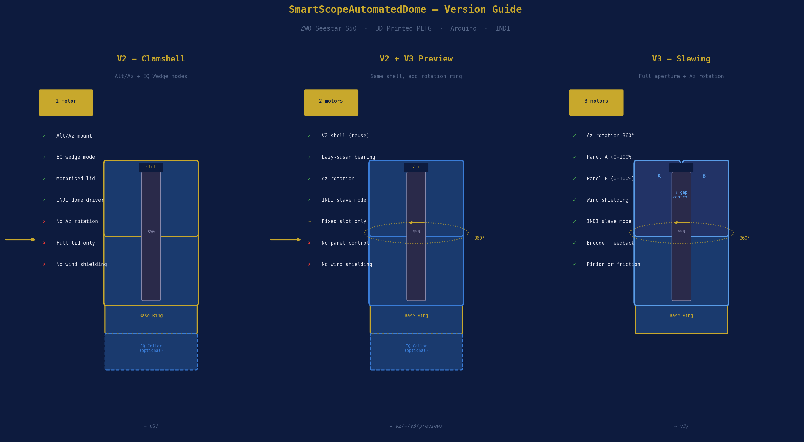
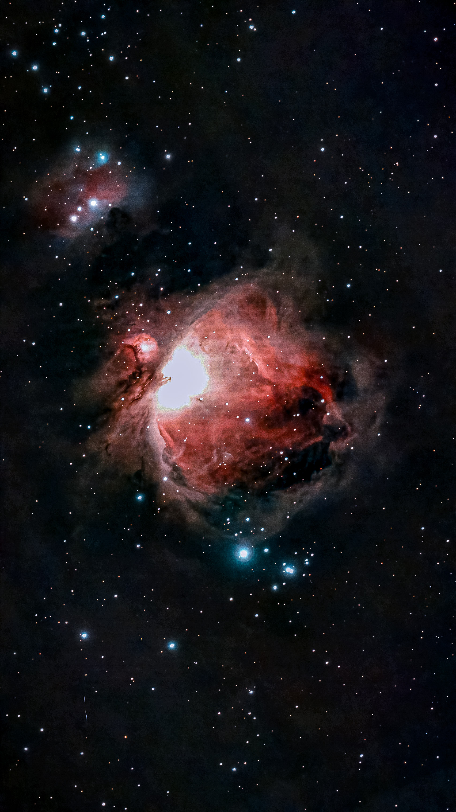

# SmartScopeAutomatedDome

> **3D-printed automated observatory domes for the ZWO Seestar S50**  
> Three versions — choose the one that fits your setup and ambition.

[](LICENSE)
[](https://indilib.org)
[](https://bambulab.com)
[](https://bambulab.com)

---



---

## Which version do I need?

Three versions exist, each adding capability on top of the last. You don't need to start at V2 — pick the one that matches what you actually want to do.

| | [V2 — Clamshell](#v2--clamshell) | [V3 — Slewing](#v3--slewing-dome) |
|---|---|---|
| **Best for** | Protecting scope overnight, simple open/close | Unattended imaging, wind shielding, precise aperture |
| **Modes** | Alt/Az + EQ wedge | Alt/Az + EQ wedge |
| **Motors** | 1 (opens lid) | 3 (Az rotation + Panel A + Panel B) |
| **Controller** | Arduino Nano | Arduino Mega 2560 |
| **Dome rotation** | Static | 360° motorised |
| **Aperture** | Full lid open or closed | Two independent panels, 0–100% each |
| **Wind shielding** | None | Yes — closed side always faces wind |
| **INDI slave mode** | No | Yes — dome tracks scope azimuth automatically |
| **Az encoder** | None | TCRT5000 IR, 36-slot, 0.0375°/step |
| **Drive options** | M8 lead screw | Ring gear + pinion OR friction wheel |
| **Est. build cost** | ~£89 | ~£140 |
| **Est. print time** | ~25 h | ~38 h |
| **Complexity** | Moderate | High |
| **README** | **[→ v2/README.md](v2/README.md)** | **[→ v3/README_V3_ADDENDUM.md](v3/README_V3_ADDENDUM.md)** |

---

## V2 — Clamshell


**The right choice if:** you want a dome that opens and closes to protect the scope, works in both Alt/Az and EQ modes, and you want something straightforward to build and commission.

V2 is a motorised clamshell — one NEMA 17 stepper drives an M8 lead screw that lifts the upper half of the dome. The dome sits still; only the lid moves. An Arduino Nano presents a serial command interface and the INDI driver handles open, close, park, and abort from within KStars/Ekos.

The key design decision in V2 is the **swappable adapter plate** — one base ring works for both modes:

- **Alt/Az** — adapter plate threads straight onto the S50 tripod
- **EQ** — a 110 mm extension collar raises the dome over your existing wedge

The dome interior (252 × 230 mm) gives the S50 complete freedom of movement. No scope-locating ribs — the scope floats inside the cavity in any position.

**[→ Full V2 README and build guide](v2/README.md)**

---

## V3 — Slewing Dome


**The right choice if:** you want the dome to track the scope automatically, shield the scope from wind on the closed side, and control exactly how wide the aperture is.

V3 keeps the same dome shell dimensions as V2 but adds a **300 mm lazy-susan bearing** so the whole dome rotates in azimuth under Motor 1. The crown slot is replaced by two independently driven panels — Motor 2 moves Panel A, Motor 3 moves Panel B — each on its own M6 lead screw and LM8UU linear guide.


In INDI slave mode the driver reads the mount's RA/Dec, converts to azimuth, and slews the dome every 5 seconds (configurable) to keep the opening aligned with the telescope. A 2° dead-band prevents hunting on minor mount movements. The closed side of the dome permanently blocks wind and dew from the opposite direction.

Two Az drive mechanisms are included in the files — choose at assembly time:

- **Ring gear + pinion** — 72:12 = 6:1 reduction, 0.0375°/step, fully printed
- **Friction wheel** — rubber wheel presses on dome outer rim, simpler to set up

**V3 uses the same base ring bottom flange as V2**, so the Alt/Az and EQ adapter plates from V2 carry across directly. No reprinting the adapters.

**[→ Full V3 README and build guide](v3/README_V3_ADDENDUM.md)**

---

## Shared architecture

Both versions are built on the same mechanical and software foundations.

### Dome shell

All versions use the same outer dome geometry — 261 × 239 mm outer, 252 × 230 mm interior. The S50 (142.5 × 130 × 257 mm body) has 55 mm clearance each side, 50 mm front/rear, and 40 mm above. The clearances are designed around the worst-case EQ mode position at 53°N latitude (Stockport) — the scope tilted 53° on the polar axis, rotating through all RA positions. At no point does the scope contact the dome interior.

### INDI integration

Both drivers appear under the **Domes** group in KStars/Ekos. Both implement the INDI Dome interface — open, close, park, abort. V3 adds `DOME_CAN_ROTATE`, `DOME_CAN_SYNC`, and INDI slave mode. Standard Ekos observatory automation works with both.

### Firmware protocol

Both use plain-text serial at 9600 baud. Commands are human-readable (`OPEN`, `CLOSE`, `GOTO 180.0`, `STATUS`). You can test the dome from any terminal — no special tools needed.

### Materials and print settings

All parts: **PETG on Bambu Lab H2S**, 0.20 mm layer height, 30% Gyroid infill, 4 walls, tree supports. Settings are embedded in every `.3mf` file. The large dome shells and base ring require the H2S **320 × 320 mm extended build volume** — rotate the base ring 45° in Bambu Studio to fit.

---

## Repository structure

```
SmartScopeAutomatedDome/
│
├── README.md                    ← You are here
│
├── v2/                          ← Clamshell dome (Alt/Az + EQ)
│   ├── README.md                ← Full V2 build guide
│   ├── openscad/                ← 7 .scad source files
│   ├── 3mf/                     ← 6 Bambu Studio .3mf files
│   ├── firmware/                ← Arduino Nano firmware
│   ├── indi/                    ← INDI dome driver (clamshell)
│   └── images/                  ← 11 renders and diagrams
│
├── v3/                          ← Slewing dome (Az rotation + panels)
│   ├── README_V3_ADDENDUM.md    ← Full V3 build guide
│   ├── openscad/                ← 5 .scad source files
│   ├── 3mf/                     ← 4 Bambu Studio .3mf files
│   ├── firmware/                ← Arduino Mega 2560 firmware
│   ├── indi/                    ← INDI slewing dome driver
│   └── images/                  ← 6 renders and diagrams
│
└── images/                      ← Main README images
    ├── version_comparison.png
    ├── v2_mode_comparison.png
    ├── v2_altaz_assembly.png
    ├── v3_assembly.png
    └── v3_crown_panels.png
```

---

## Quick start

**V2:**
```bash
# Print: v2/3mf/01_base_ring.3mf through 05_hardware_parts.3mf
# Upload firmware
arduino-cli compile --fqbn arduino:avr:nano v2/firmware/dome_controller/dome_controller.ino
arduino-cli upload -p /dev/ttyUSB0 --fqbn arduino:avr:nano v2/firmware/dome_controller/dome_controller.ino
# Build and install INDI driver
cd v2/indi && mkdir build && cd build && cmake -DCMAKE_INSTALL_PREFIX=/usr .. && make -j4 && sudo make install
indiserver -v indi_seestar_nano_dome
```

**V3:**
```bash
# Print: v3/3mf/01_base_ring.3mf through 04_drive_hardware.3mf
# Upload firmware (Arduino Mega)
arduino-cli compile --fqbn arduino:avr:mega v3/firmware/dome_controller_v3/dome_controller_v3.ino
arduino-cli upload -p /dev/ttyUSB0 --fqbn arduino:avr:mega v3/firmware/dome_controller_v3/dome_controller_v3.ino
# Build and install INDI driver
cd v3/indi && mkdir build && cd build && cmake -DCMAKE_INSTALL_PREFIX=/usr .. && make -j4 && sudo make install
indiserver -v indi_seestar_slewing_dome
```

---

## Parts sourcing

All hardware links (AliExpress search URLs) are in each version's README under the Bill of Materials section.

Common to both versions: NEMA 17 stepper, A4988 driver, M8 stainless rod, F688ZZ bearing, Omron SS-5GL limit switches, M4/M5 fasteners, PETG filament.

V3 additions: 300 mm lazy-susan bearing, 8 mm guide rods, LM8UU linear bearings, M6 threaded rod, TCRT5000 IR sensor, Arduino Mega 2560, 30 mm rubber wheel.

---

## Scope compatibility

The dome interior dimensions are sized for the **ZWO Seestar S50** (142.5 × 130 × 257 mm). To adapt for a different scope, edit `openscad/params.scad` in either version — update `s50_w`, `s50_d`, `s50_h` and re-export. All clearances and bearing seats recalculate automatically.

Tested clearances work for the **S50 in equatorial mode at 53°N**. For other latitudes, update `LATITUDE` in `params.scad`.

---

## Contributing

Issues and pull requests welcome. Before starting significant structural changes please open an issue to align on approach.

If you build either version, photos of the completed dome are very welcome — open a Discussion.

---

## Licence

Copyright © Neil Manfred. Licensed under the Creative Commons Attribution-NonCommercial-NoDerivatives 4.0 International License. Commercial use and derivative works are not permitted. — see [LICENSE](LICENSE) — CC BY-NC-SA 4.0, non-commercial use only.

---

*Built by [@neilmanfredit](https://github.com/neilmanfredit)*

---

## Gallery

### M42 — Orion Nebula



*Captured with the ZWO Seestar S50, 31 December 2025 — Bodmin Moor, Cornwall.*

The Orion Nebula (M42) captured from Bodmin Moor on New Year's Eve 2025. Bodmin Moor is one of the darkest sites in southern England, and the skies here show it — the image reveals the Trapezium cluster blazing at the core, four young massive stars responsible for ionising the surrounding gas and producing the characteristic red hydrogen-alpha glow. The Running Man Nebula (NGC 1977) is visible in the upper left, its blue reflection nebulosity contrasting with the warmer tones of M42. Dark dust lanes cut through the nebula, forming the distinctive fish-mouth shape around the bright central region. The Orion Nebula sits approximately 1,344 light years from Earth and is one of the most studied star-forming regions in the Milky Way. A stellar result from a 50mm aperture scope under genuinely dark skies.

---

## Gallery

### M42 — Orion Nebula


*Captured with the ZWO Seestar S50, 31 December 2025 — Bodmin Moor, Cornwall.*

The Orion Nebula (M42) captured from Bodmin Moor on New Year's Eve 2025. Bodmin Moor is one of the darkest sites in southern England, and the skies here show it — the image reveals the Trapezium cluster blazing at the core, four young massive stars responsible for ionising the surrounding gas and producing the characteristic red hydrogen-alpha glow. The Running Man Nebula (NGC 1977) is visible in the upper left, its blue reflection nebulosity contrasting with the warmer tones of M42. Dark dust lanes cut through the nebula, forming the distinctive fish-mouth shape around the bright central region. The Orion Nebula sits approximately 1,344 light years from Earth and is one of the most studied star-forming regions in the Milky Way. A stellar result from a 50mm aperture scope under genuinely dark skies.
