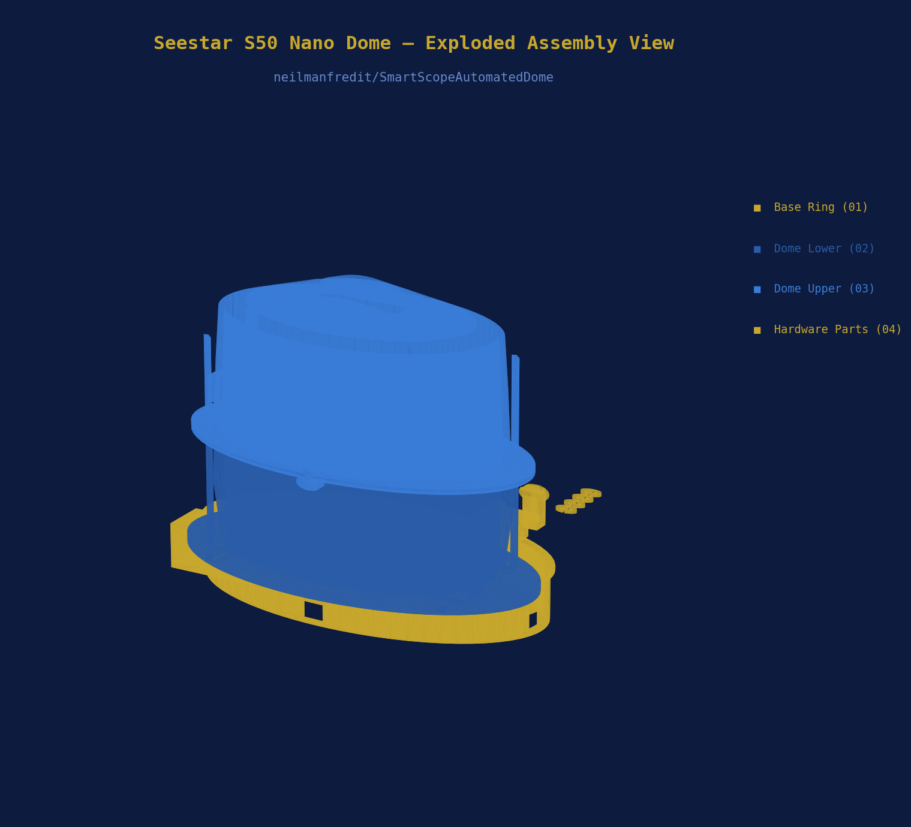
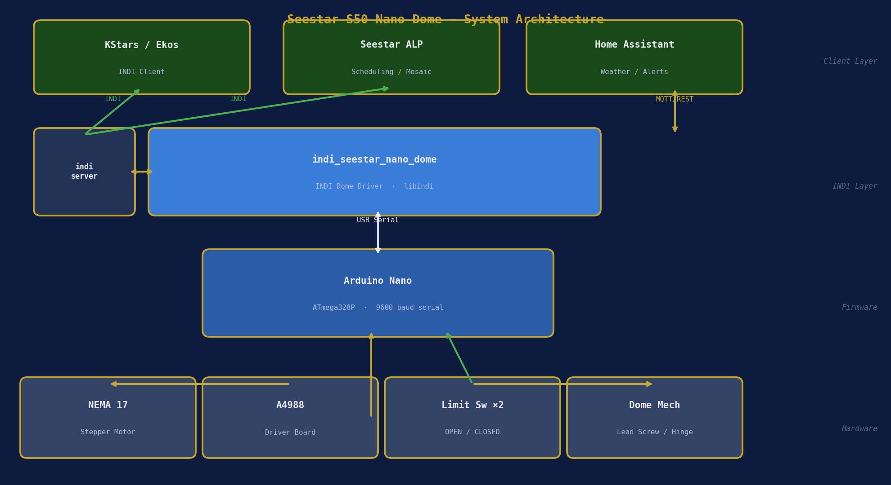
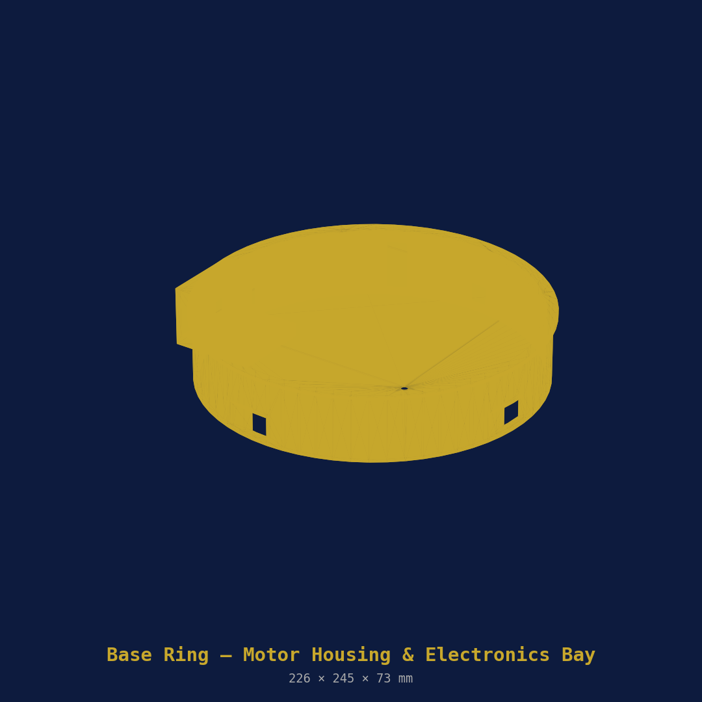
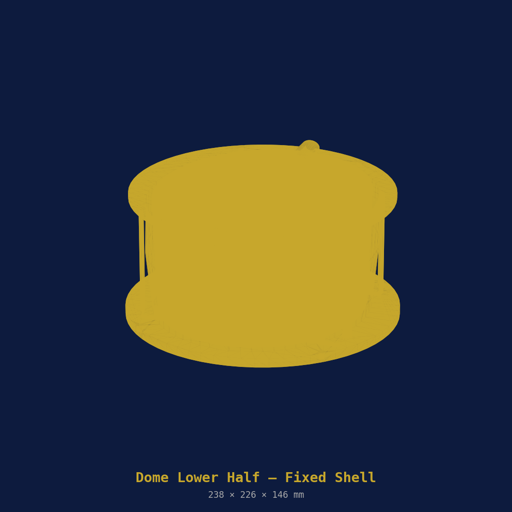
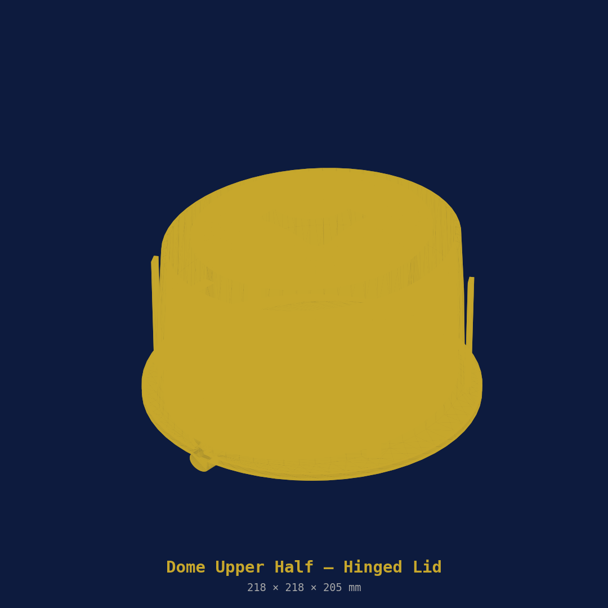
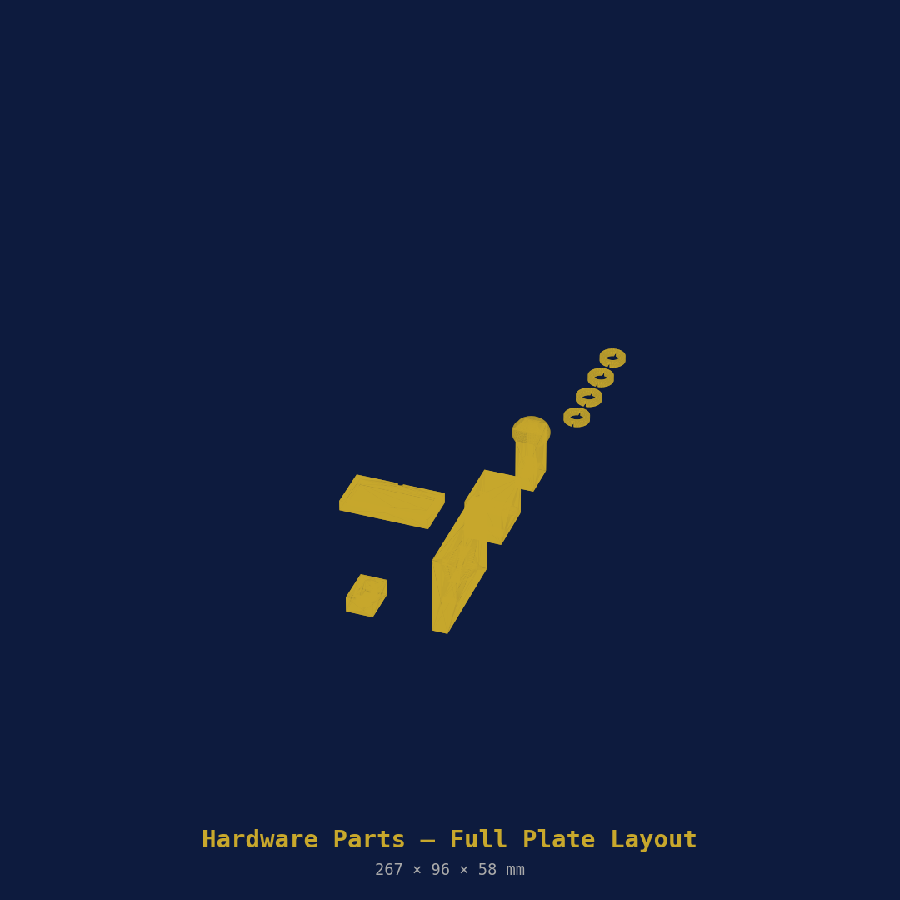
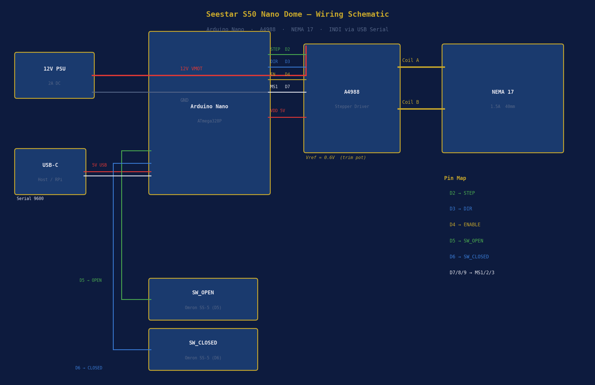

# SmartScopeAutomatedDome

> **Motorised 3D-printed clamshell observatory for the ZWO Seestar S50**  
> NEMA 17 stepper · Arduino Nano · INDI Dome driver · PETG on Bambu Lab H2S

[](LICENSE)
[](https://indilib.org)
[](https://bambulab.com)
[](https://bambulab.com)

---



---

## Overview

A portable, automated observatory dome sized for the **ZWO Seestar S50** (142.5 × 130 × 257 mm). The dome opens and closes like a clamshell via an M8 lead screw driven by a NEMA 17 stepper motor. An Arduino Nano handles the motor and limit switches, and presents a standard serial interface consumed by a custom **INDI Dome driver** — so the dome integrates directly with KStars/Ekos for fully unattended imaging sessions.

Design reference: [Nano Dome V2](https://www.cloudynights.com/forums/topic/1000995-miniature-3d-printed-clamshell-observatory-nano-dome/) by spbalaji (Cloudy Nights, May 2026), extended for the larger S50 body and full motorised automation.

### Key features

- **Fully INDI-compatible** — shows as a standard Dome device in KStars/Ekos
- **Self-locking lead screw** — dome stays put with motor power off, no holding current
- **Dual limit switches** — hard stops at fully open and fully closed, no overrun possible
- **Trapezoidal acceleration** — smooth ramp up/down, no missed steps
- **Electronics bay built in** — Arduino Nano + A4988 driver live inside the base ring
- **PETG throughout** — weather-resistant, dimensionally stable, prints on standard printers
- **~£71 total build cost** — excluding the S50 itself

---

## Table of Contents

- [System Architecture](#system-architecture)
- [Printed Parts](#printed-parts)
  - [Part 01 — Base Ring](#part-01--base-ring)
  - [Part 02 — Dome Lower Half](#part-02--dome-lower-half)
  - [Part 03 — Dome Upper Half](#part-03--dome-upper-half)
  - [Part 04 — Hardware Parts Plate](#part-04--hardware-parts-plate)
- [Print Settings](#print-settings)
- [Bill of Materials](#bill-of-materials)
- [Wiring](#wiring)
- [Firmware](#firmware)
- [INDI Driver](#indi-driver)
- [Assembly](#assembly)
- [Commissioning](#commissioning)
- [Integration with Seestar ALP](#integration-with-seestar-alp)
- [Contributing](#contributing)
- [Licence](#licence)

---

## System Architecture



The stack runs in four layers:

| Layer | Component | Role |
|-------|-----------|------|
| **Hardware** | NEMA 17 + A4988 + limit switches | Physical motion |
| **Firmware** | Arduino Nano (`dome_controller.ino`) | Serial command interface |
| **INDI** | `indi_seestar_nano_dome` | Dome device driver |
| **Client** | KStars/Ekos · Seestar ALP · Home Assistant | Scheduling, weather, control |

---

## Printed Parts

All parts print in **PETG** on a Bambu Lab H2S with the settings in the [Print Settings](#print-settings) section. The H2S 320 × 320 mm bed accommodates every part individually with room to spare. `.3mf` files with the full print profile embedded are in the [`3mf/`](3mf/) directory.

---

### Part 01 — Base Ring



The foundation of the dome. Sits on the Seestar S50 tripod via a 3/8" brass threaded insert pressed into the base. Houses the NEMA 17 motor in a dedicated rear pocket, an electronics bay for the Arduino Nano and A4988 driver board, and an integrated M8 lead screw nut trap.

| Property | Value |
|----------|-------|
| File | `openscad/01_base_ring.scad` |
| 3MF | `3mf/01_base_ring.3mf` |
| Outer diameter | ~232 mm |
| Height | 60 mm |
| Est. print time | ~5 h |
| Filament | ~180 g PETG |
| Orientation | Flat, open top face up |
| Supports | None required |

**Hardware captured in this part:**
- M10 × 12 mm brass knurled insert (bottom centre, 3/8" tripod thread)
- NEMA 17 motor (rear pocket, M3 × 8 bolts)
- Arduino Nano tray (snap-fit, electronics bay)
- A4988 driver + breadboard (electronics bay)
- M8 × 1.25 threaded rod (passes through base bore)

---

### Part 02 — Dome Lower Half



The fixed lower shell. Ovoid cross-section (not hemispherical) to clear the S50 body at all telescope positions. Bolts to the base ring top flange. The split is at 130 mm above the base top face. Internal scope-locating ribs grip the S50 base plate and prevent it shifting.

| Property | Value |
|----------|-------|
| File | `openscad/02_dome_lower.scad` |
| 3MF | `3mf/02_dome_lower.3mf` |
| Interior width | ~192 mm |
| Interior depth | ~170 mm |
| Split height | 130 mm |
| Est. print time | ~9 h |
| Filament | ~260 g PETG |
| Orientation | Flat bottom on plate, interior facing up |
| Supports | Tree auto on internal arch overhangs only |

**Features:**
- 4× M4 bolt holes to base ring flange
- Hinge bosses (left and right at split line) for M8 × 80 mm hinge pin
- M8 nut trap at rear wall — captured hex nut holds lead screw
- USB-C pass-through grommet hole (rear, low)
- Four internal scope locating pads

---

### Part 03 — Dome Upper Half



The hinged lid. Mirrors the lower shell geometry above the split. A 70 × 70 mm aperture at the crown keeps the S50's field of view completely unobstructed at all tilt angles. The sealing lip overlaps the lower flange by 6 mm. A foam-seal groove is moulded into the split face.

| Property | Value |
|----------|-------|
| File | `openscad/03_dome_upper.scad` |
| 3MF | `3mf/03_dome_upper.3mf` |
| Hinge travel | ~110° |
| Crown aperture | 70 × 70 mm |
| Est. print time | ~8 h |
| Filament | ~220 g PETG |
| Orientation | Split face **down** on plate (exterior faces up for best surface finish) |
| Supports | Tree auto for internal overhangs |

**Features:**
- Hinge knuckles (female) mate with lower half bosses, M8 pin
- Lead screw pivot bracket (rear) — connects to motor drive rod
- Sealing lip overlaps lower flange 6 mm
- 3 mm half-round foam seal groove at split face
- Exterior ribs aligned with lower half for visual continuity

---

### Part 04 — Hardware Parts Plate



All six small parts on a single plate. Print once and you have everything else you need.

| Property | Value |
|----------|-------|
| File | `openscad/04_hardware_parts.scad` |
| 3MF | `3mf/04_hardware_parts.3mf` |
| Est. print time | ~3 h |
| Filament | ~80 g PETG |
| Orientation | All flat, no supports |

| Sub-part | Qty | Purpose |
|----------|-----|---------|
| Motor mount bracket (4a) | 1 | Bolts NEMA 17 to base ring rear |
| Lead screw bearing block (4b) | 1 | Lower M8 rod end, F688 bearing pocket |
| Lead screw pivot arm (4c) | 1 | Clevis connecting rod to lid bracket |
| Hinge pin retainer clip (4d) | 4 | Snap clips, prevent M8 pin walking axially |
| Limit switch bracket (4e) | 1 | Mounts Omron SS-5 at fully-open position |
| Arduino Nano tray (4f) | 1 | Snap-fit tray for electronics bay |

---

## Print Settings

Tested and tuned for the **Bambu Lab H2S** with generic PETG. These settings are embedded in every `.3mf` file — open in Bambu Studio and they load automatically.

| Setting | Value |
|---------|-------|
| Layer height | 0.20 mm |
| Initial layer height | 0.20 mm |
| Walls | 4 |
| Top / bottom layers | 5 |
| Infill | 30% Gyroid |
| Supports | Tree (auto) |
| Brim | 5 mm outer only |
| Nozzle temperature | 240 °C |
| Bed temperature | 70 °C |
| Part cooling fan | 30% max |
| Max volumetric speed | 12 mm³/s |

> **Tip:** Print `04_hardware_parts.3mf` first. It is the fastest plate and validates your PETG settings before committing to the multi-hour dome shells.

---

## Bill of Materials

### Hardware

| Item | Qty | Notes |
|------|-----|-------|
| NEMA 17 stepper (40 mm body) | 1 | 1.5 A, 59 Ncm min |
| A4988 stepper driver module | 1 | With heatsink |
| Arduino Nano (ATmega328P) | 1 | CH340 USB-C variant |
| M8 × 1.25 threaded rod, 200 mm | 1 | Stainless |
| M8 flange nut | 2 | One captured in lower dome |
| M8 rod, 80 mm | 1 | Hinge pin, stainless |
| F688ZZ flanged bearing (8 × 16 × 5) | 1 | Lead screw lower end |
| Flexible shaft coupler 5 mm → 8 mm | 1 | Motor to lead screw |
| Omron SS-5 micro-switch | 2 | Limit: open + closed |
| M4 × 12 cap head bolt | 12 | Dome flanges |
| M4 × 8 cap head bolt | 8 | Motor bracket |
| M4 hex nut | 20 | |
| M3 × 8 cap head bolt | 4 | Motor face bolts |
| M8 × 10 knurled brass insert | 1 | Tripod thread in base |
| 3/8" to M10 tripod adaptor | 1 | S50 tripod mount |
| 3 mm foam strip, 600 mm | 1 | Weather seal groove |
| Epoxy (e.g. Araldite Rapid) | 1 tube | Flange joint reinforcement |
| USB-A to USB-C cable, 1 m | 1 | Arduino serial to host |
| 12 V PSU, 2 A | 1 | Stepper power |
| DC barrel jack 5.5/2.1 mm | 2 | PSU to board |
| DuPont jumper wires | 20 | |

### Approximate Cost (UK)

| Category | Approx. |
|----------|---------|
| PETG filament × 2 spools | £28 |
| NEMA 17 stepper | £12 |
| A4988 + Arduino Nano | £8 |
| M8 hardware (rod, nuts, bearing) | £6 |
| Flexible coupler + micro-switches | £5 |
| M4/M3 fasteners + inserts | £4 |
| PSU + wiring | £8 |
| **Total** | **~£71** |

---

## Wiring



### Pin Map

| Arduino Pin | Connection | Notes |
|-------------|-----------|-------|
| D2 | A4988 STEP | |
| D3 | A4988 DIR | |
| D4 | A4988 ENABLE | LOW = enabled |
| D5 | SW_OPEN (NO) | Input pullup; dome fully open |
| D6 | SW_CLOSED (NO) | Input pullup; dome fully closed |
| D7 | A4988 MS1 | HIGH → 1/8 microstepping |
| D8 | A4988 MS2 | LOW |
| D9 | A4988 MS3 | LOW |
| D13 | Status LED | Built-in |
| VIN | 12 V PSU | Via 7805 or 12 V-tolerant Nano |
| 5V | A4988 VDD | |
| GND | Common ground | PSU, A4988, switch common |

### A4988 Vref

Set Vref to **0.6 V** (measure on pot wiper to GND):

```
Vref = Imax × 0.8 / 2 = 1.5 × 0.8 / 2 = 0.6 V
```

### Microstepping

MS1 = HIGH, MS2 = LOW, MS3 = LOW → **1/8 step** = 1600 steps/rev

### Steps per mm

```
Steps/mm = 1600 ÷ 1.25 = 1280 steps/mm
Full open travel = 100 mm × 1280 = 128,000 steps
```

---

## Firmware

Source: [`firmware/dome_controller/dome_controller.ino`](firmware/dome_controller/dome_controller.ino)

### Serial Command Reference

All commands at **9600 baud, newline terminated**.

| Command | Response | Description |
|---------|----------|-------------|
| `OPEN` | `OPENING` → `OPEN` | Open dome fully |
| `CLOSE` | `CLOSING` → `CLOSED` | Close dome fully |
| `STOP` | `STOPPED` | Immediate halt |
| `ABORT` | `STOPPED` | Alias for STOP |
| `STATUS` | `OPEN` / `CLOSED` / `OPENING` / `CLOSING` + `POS:nnnnn` | Current state + step position |
| `STEP nn` | `JOGGED:nn` | Jog ±nn steps (+ = open, − = close) |

### Upload

```bash
# Install Arduino CLI
curl -fsSL https://raw.githubusercontent.com/arduino/arduino-cli/master/install.sh | sh

# Add Nano board
arduino-cli core install arduino:avr

# Compile and upload
arduino-cli compile --fqbn arduino:avr:nano \
  firmware/dome_controller/dome_controller.ino

arduino-cli upload -p /dev/ttyUSB0 --fqbn arduino:avr:nano \
  firmware/dome_controller/dome_controller.ino
```

### Quick test

```bash
screen /dev/ttyUSB0 9600
# Wait for: DOME_READY
STATUS      # → CLOSED  POS:0
OPEN        # → OPENING ... OPEN
STATUS      # → OPEN    POS:128000
CLOSE       # → CLOSING ... CLOSED
```

---

## INDI Driver

Source: [`indi/seestar_nano_dome.cpp`](indi/seestar_nano_dome.cpp)

Inherits `INDI::Dome`. Implements Open, Close, Park (= Close), Abort, and 1 Hz status polling. Appears in KStars/Ekos as **"Seestar Nano Dome"** under the Domes group. Serial port is configurable as an INDI property (default `/dev/ttyUSB0`).

### Build

```bash
# Dependencies (Debian/Ubuntu)
sudo apt install libindi-dev cmake build-essential

cd indi
mkdir build && cd build
cmake -DCMAKE_INSTALL_PREFIX=/usr ..
make -j4
sudo make install
```

### Launch

```bash
# Standalone
indiserver -v indi_seestar_nano_dome

# In KStars/Ekos:
# Equipment Profiles → Add → Dome → Seestar Nano Dome
# Set port: /dev/ttyUSB0 → Connect
```

---

## Assembly

### Phase 1 — Print & Post-process

1. Print all four plates per settings above
2. Remove supports; sand split-line mating faces with 120 grit
3. Heat-press M4 inserts into flange holes (optional — PETG taps directly with M4)
4. Press M8 brass insert into base ring bottom (tripod mount); epoxy if loose

### Phase 2 — Base Ring

1. Mount motor bracket (4a) to rear of base ring with M4 × 8 bolts
2. Bolt NEMA 17 to bracket with M3 × 8, shaft pointing inward
3. Fit flexible coupler on motor shaft
4. Insert M8 threaded rod through base bore; attach to coupler
5. Press F688 bearing into bearing block (4b); secure inside base ring cavity
6. Snap Arduino Nano tray (4f) into electronics bay
7. Mount A4988 alongside; wire per diagram
8. Set A4988 Vref to 0.6 V

### Phase 3 — Dome Lower Half

1. Seat lower dome half onto base ring top flange; 4× M4 bolts, snug but not tight
2. Test fit with S50 — locating ribs should grip scope base plate
3. Epoxy the flange joint once satisfied

### Phase 4 — Hinge & Lid

1. Set upper dome half beside lower half, inverted
2. Interleave hinge knuckles; slide M8 × 80 mm stainless pin through
3. Fit hinge retainer clips (4d) to each end; press until they snap
4. Verify lid swings freely through ~110° of travel

### Phase 5 — Lead Screw Drive

1. Thread M8 rod through captured nut in lower dome rear wall
2. Attach upper pivot arm (4c) to lid rear bracket with M8 pin
3. Thread rod into pivot arm nut trap
4. Check: motor rotating clockwise (from rear) should push lid open

### Phase 6 — Limit Switches

1. Snap limit switch bracket (4e) to top rim (SW_OPEN)
2. Mount second micro-switch to base ring lip (SW_CLOSED)
3. Position so each switch activates just before the mechanical stop
4. Wire NO terminals to Arduino D5/D6 and GND

### Phase 7 — Weather Seal

1. Press 3 mm foam strip into the groove on the lid sealing lip
2. Close dome and verify seal is compressed evenly all the way round

---

## Commissioning

Run through this checklist before trusting the dome in an unattended session:

- [ ] Motor runs in the correct direction — if lid tries to close on `OPEN`, swap coil pair (1B or 2B on A4988)
- [ ] SW_CLOSED trips before lid crushes base ring — add 2 mm shim if needed
- [ ] SW_OPEN trips before lead screw runs out of thread
- [ ] `STATUS` returns `OPEN` / `CLOSED` correctly in INDI
- [ ] Dome opens and closes via Ekos UI without fault
- [ ] Lead screw nut stays captured under full lid-weight load
- [ ] Weather seal compressed evenly when closed
- [ ] S50 tripod thread seats fully into base ring brass insert

---

## Integration with Seestar ALP

[Seestar ALP](https://github.com/smart-underworld/seestar_alp) runs alongside `indiserver`. Once both are running, KStars/Ekos will:

- Open the dome before an imaging session starts
- Close dome if a weather alert fires or the session ends
- Park (close) on abort

For fully unattended operation, trigger via MQTT:

```bash
# Close dome on weather alert via MQTT
mosquitto_sub -t 'weather/alert' | while read msg; do
  echo "CLOSE" > /dev/ttyUSB0
done
```

---

## Repository Structure

```
SmartScopeAutomatedDome/
├── openscad/
│   ├── params.scad                  # Shared dimensions — edit clearances here
│   ├── 01_base_ring.scad
│   ├── 02_dome_lower.scad
│   ├── 03_dome_upper.scad
│   └── 04_hardware_parts.scad
├── 3mf/
│   ├── 01_base_ring.3mf             # Bambu Studio ready, full print profile embedded
│   ├── 02_dome_lower.3mf
│   ├── 03_dome_upper.3mf
│   └── 04_hardware_parts.3mf
├── firmware/
│   └── dome_controller/
│       └── dome_controller.ino
├── indi/
│   ├── seestar_nano_dome.cpp
│   ├── CMakeLists.txt
│   └── indi_seestar_nano_dome.xml
├── images/
│   ├── render_00_assembly.png
│   ├── render_01_base_ring.png
│   ├── render_02_dome_lower.png
│   ├── render_03_dome_upper.png
│   ├── render_04_hardware_parts.png
│   ├── render_05_wiring.png
│   └── render_06_architecture.png
└── README.md
```

---

## Contributing

Pull requests welcome. If you adapt this for a different scope (S30, S30 Pro, Dwarf 3) the key change is in `openscad/params.scad` — update `s50_w`, `s50_d`, `s50_h` to match your scope body dimensions. Everything else rebuilds from those values.

Please open an issue before starting a significant change so we can align on approach.

---

## Licence

MIT — see [LICENSE](LICENSE).

Design inspired by the [Nano Dome V2](https://www.cloudynights.com/forums/topic/1000995-miniature-3d-printed-clamshell-observatory-nano-dome/) by spbalaji (Cloudy Nights).

---

*Built by [@neilmanfredit](https://github.com/neilmanfredit)*
