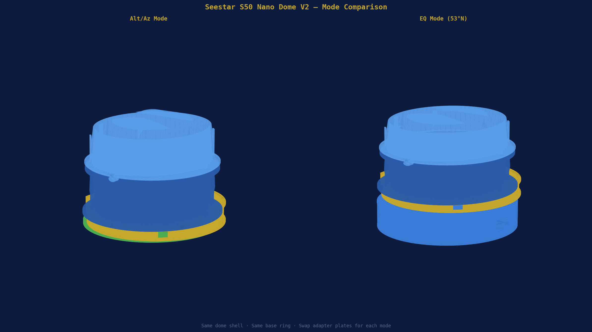
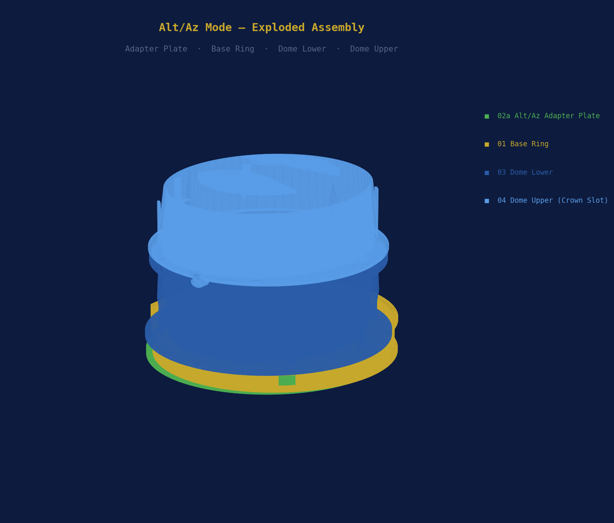
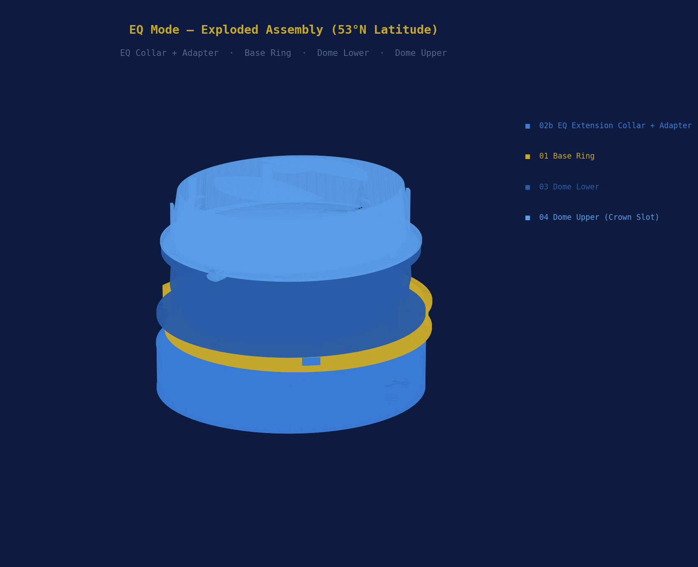
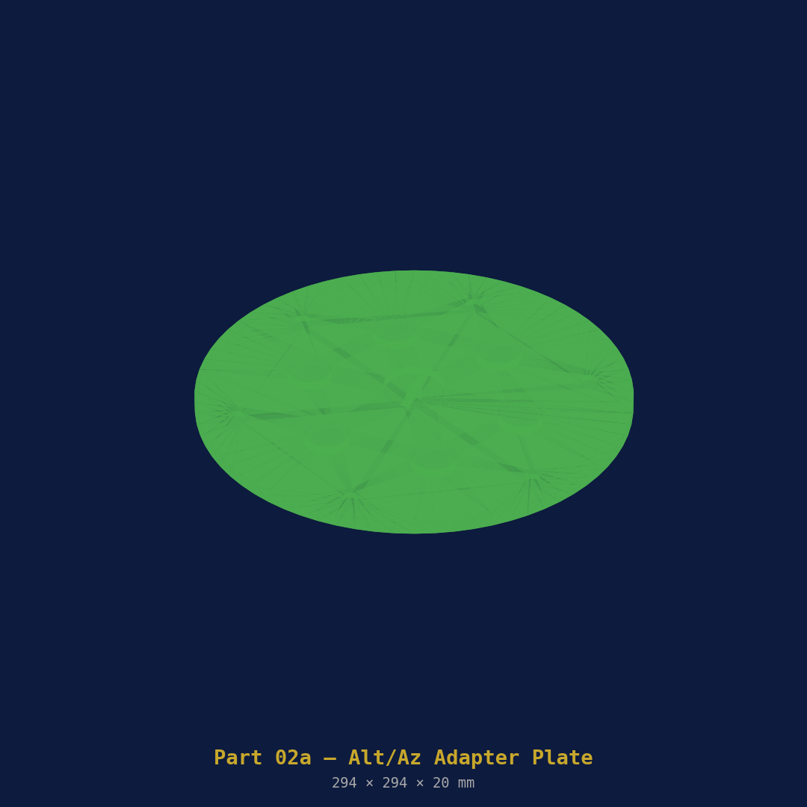
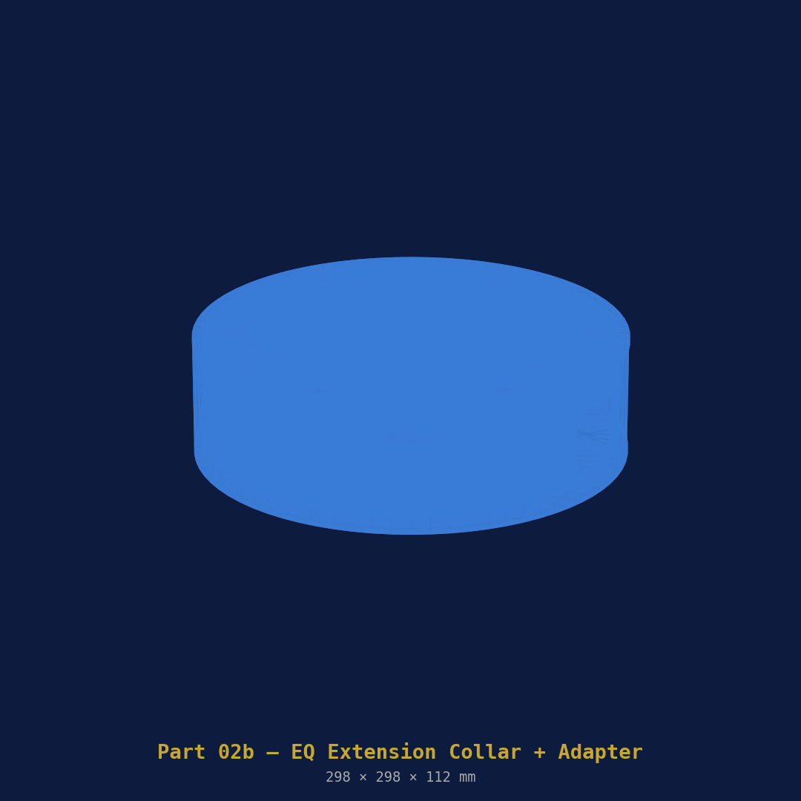
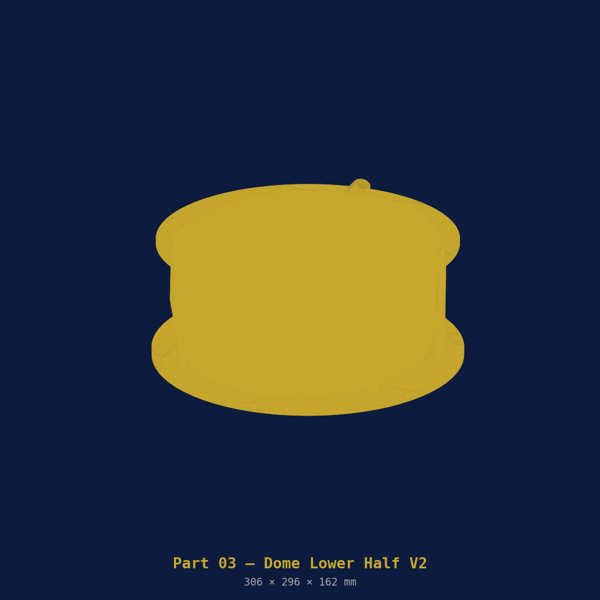
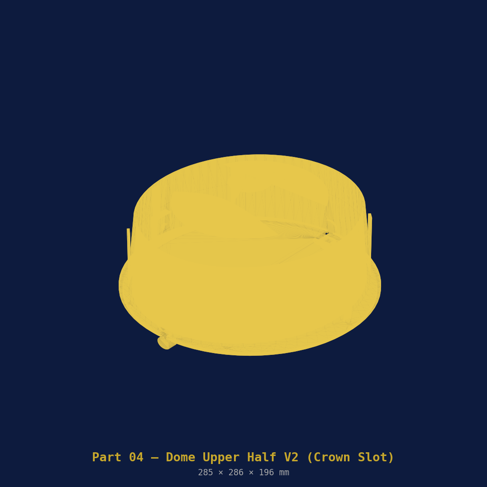

# SmartScopeAutomatedDome

> **Motorised 3D-printed clamshell observatory for the ZWO Seestar S50**  
> Supports **Alt/Az and EQ Wedge** modes · NEMA 17 stepper · Arduino Nano · INDI Dome driver · PETG on Bambu Lab H2S

[](LICENSE)
[](https://indilib.org)
[](https://bambulab.com)
[](https://bambulab.com)
[](#modes)

---



---

## Overview

A portable, automated observatory dome sized to surround the **ZWO Seestar S50** (142.5 × 130 × 257 mm body) in both Alt/Az and equatorial (EQ wedge) configurations. The dome opens and closes like a clamshell via an M8 lead screw driven by a NEMA 17 stepper. An Arduino Nano handles the motor and limit switches and presents a standard serial interface consumed by a custom **INDI Dome driver** — integrating directly with KStars/Ekos for fully unattended imaging sessions.

Design reference: [Nano Dome V2](https://www.cloudynights.com/forums/topic/1000995-miniature-3d-printed-clamshell-observatory-nano-dome/) by spbalaji (Cloudy Nights, May 2026), substantially redesigned for the larger S50 body, full range of motion in both modes, and complete motorised automation.

### What changed from V1

| V1 | V2 |
|----|----|
| Single fixed mount mode | Alt/Az and EQ wedge — swappable adapter plates |
| 192 × 170 mm interior | 252 × 230 mm interior — scope moves completely freely |
| Scope locating ribs (gripped scope) | No ribs — scope floats inside dome |
| 70 × 70 mm square crown aperture | Full-length front-to-back crown slot (80 mm wide) |
| M8 hinge pin | M10 hinge pin — stronger for larger, heavier lid |
| No wedge clearance | EQ extension collar adds 110 mm over wedge stack |
| 232 mm base ring diameter | 314 mm base ring — proportionate to larger dome |

---

## Table of Contents

- [How It Works](#how-it-works)
- [Modes](#modes)
- [System Architecture](#system-architecture)
- [Printed Parts](#printed-parts)
  - [Part 01 — Universal Base Ring](#part-01--universal-base-ring)
  - [Part 02a — Alt/Az Adapter Plate](#part-02a--altaz-adapter-plate)
  - [Part 02b — EQ Extension Collar + Adapter](#part-02b--eq-extension-collar--adapter)
  - [Part 03 — Dome Lower Half](#part-03--dome-lower-half)
  - [Part 04 — Dome Upper Half](#part-04--dome-upper-half)
  - [Part 05 — Hardware Parts Plate](#part-05--hardware-parts-plate)
- [Print Settings](#print-settings)
- [Bill of Materials](#bill-of-materials)
- [Wiring](#wiring)
- [Firmware](#firmware)
- [INDI Driver](#indi-driver)
- [Assembly](#assembly)
  - [Alt/Az Assembly](#altaz-assembly)
  - [EQ Assembly](#eq-assembly)
- [Commissioning](#commissioning)
- [Integration with Seestar ALP](#integration-with-seestar-alp)
- [Contributing](#contributing)
- [Licence](#licence)

---

## How It Works

The dome shell (lower + upper halves) sits around the S50 without touching it. The scope moves freely inside the cavity in any direction — the dome is purely a weather enclosure, not a structural mount. The full-length crown slot allows the scope to point from approximately 15° altitude up to zenith in both Alt/Az and EQ mode without clipping the dome interior.

The dome is opened and closed by a NEMA 17 stepper motor driving an M8 lead screw. The lead screw pushes and pulls the upper lid via a rear pivot arm. Two Omron SS-5 micro-switches provide hard stops at fully open and fully closed — the firmware checks both on every step, so there is no risk of overrun.

---

## Modes



**Alt/Az mode** — the dome mounts directly onto the S50's own tripod via the **Alt/Az Adapter Plate (02a)**. The adapter bolts to the base ring bottom flange and threads onto the tripod head via a 3/8" brass insert. Total stack height is the base ring + dome shell only.

---



**EQ mode (53°N latitude)** — the **EQ Extension Collar + Adapter (02b)** replaces the Alt/Az adapter. The adapter bolts to your existing 3D-printed wedge top plate (4× M4, 60 mm square bolt pattern). The 110 mm collar raises the base ring and dome shell above the wedge stack, providing full clearance for the scope tilted at 53° on the polar axis as it rotates through all RA positions.

**Switching modes:** Remove 6× M5 bolts from the base ring bottom flange, swap the adapter plate (or add/remove the extension collar), refit bolts. Takes about 10 minutes.

---

## System Architecture


| Layer | Component | Role |
|-------|-----------|------|
| **Hardware** | NEMA 17 + A4988 + limit switches | Physical motion |
| **Firmware** | Arduino Nano (`dome_controller.ino`) | Serial command interface |
| **INDI** | `indi_seestar_nano_dome` | Dome device driver |
| **Client** | KStars/Ekos · Seestar ALP · Home Assistant | Scheduling, weather, control |

---

## Printed Parts

All parts print in **PETG** on a Bambu Lab H2S. `.3mf` files with the full Bambu print profile embedded are in [`3mf/`](3mf/). The dome shell and base ring are too large for the H2S 256 × 256 mm standard bed — they require the **H2S extended build volume (320 × 320 mm)**. See notes per part.

You only print **one set of dome shells** regardless of mode. The only parts that differ between modes are the adapter plates.

---

### Part 01 — Universal Base Ring


The structural foundation common to both modes. Contains the motor housing, electronics bay, and lead screw mechanism. The bottom face accepts either adapter plate via 6× M5 bolts. The top flange mates with the dome lower half.

| Property | Value |
|----------|-------|
| File | `openscad/01_base_ring.scad` |
| 3MF | `3mf/01_base_ring.3mf` |
| Outer diameter | ~314 mm |
| Height | 65 mm |
| Est. print time | ~6 h |
| Filament | ~220 g PETG |
| Orientation | Flat, open top face up |
| Supports | None |
| Bed required | 320 × 320 mm (H2S extended) — rotate 45° on plate |

**Captured hardware:** NEMA 17 motor (rear pocket) · Arduino Nano tray · A4988 driver · M8 lead screw · electronics wiring bay

---

### Part 02a — Alt/Az Adapter Plate



Sits between the base ring and the S50 tripod head. Labelled **ALT/AZ** on the top face. Threaded brass insert at centre accepts the S50 tripod's 3/8" thread via an M10 adaptor.

| Property | Value |
|----------|-------|
| File | `openscad/02a_adapter_altaz.scad` |
| 3MF | `3mf/02a_adapter_altaz.3mf` |
| Diameter | ~322 mm |
| Thickness | 12 mm |
| Est. print time | ~1.5 h |
| Filament | ~60 g PETG |
| Orientation | Flat, top face up |
| Supports | None |

**Hardware:** M10 × 12 mm brass knurled insert (centre) · 6× M5 cap head bolts (to base ring)

---

### Part 02b — EQ Extension Collar + Adapter



Two-part solution for EQ mode. The **adapter plate** (bottom) bolts to your existing wedge top plate. The **extension collar** (110 mm tall) raises the entire dome above the wedge stack, providing clearance for the scope rotating on the RA axis. Labelled **EQ** and **EQ MODE** respectively.

| Property | Value |
|----------|-------|
| File | `openscad/02b_eq_extension.scad` |
| 3MF | `3mf/02b_eq_extension.3mf` |
| Collar height | 110 mm |
| Wedge bolt pattern | 4× M4, 60 mm square (standard DIY S50 wedge) |
| Est. print time | Collar ~4 h · Adapter ~1 h |
| Filament | ~180 g + 55 g PETG |
| Orientation | Collar upright · Adapter flat |
| Supports | None |

> **Note:** The 60 mm square M4 bolt pattern matches the most common 3D-printed EQ wedge designs for the Seestar S50. If your wedge uses a different pattern, edit `openscad/02b_eq_extension.scad` — the bolt positions are clearly commented.

---

### Part 03 — Dome Lower Half



The fixed lower shell. Ovoid cross-section to clear the S50 at all telescope positions in both modes. No scope-locating ribs — the scope floats freely. Bolts to the base ring top flange with 6× M4.

| Property | Value |
|----------|-------|
| File | `openscad/03_dome_lower.scad` |
| 3MF | `3mf/03_dome_lower.3mf` |
| Interior width | ~252 mm |
| Interior depth | ~230 mm |
| Split height | 145 mm |
| Est. print time | ~11 h |
| Filament | ~320 g PETG |
| Orientation | Flat bottom on plate, interior up |
| Supports | Tree auto (internal arch overhangs) |
| Bed required | 320 × 320 mm (H2S extended) |

**Features:** M10 hinge bosses left and right · Rear M8 lead screw nut trap · Front USB-C cable channel · Side motor cable chase

---

### Part 04 — Dome Upper Half



The hinged lid. The key change from V1 is the **full-length crown slot** — an 80 mm wide opening running the full front-to-back depth of the dome. This allows the S50 to point from approximately 15° altitude to zenith in any azimuth in Alt/Az mode, and through the full RA rotation in EQ mode, without clipping the dome interior at any position.

| Property | Value |
|----------|-------|
| File | `openscad/04_dome_upper.scad` |
| 3MF | `3mf/04_dome_upper.3mf` |
| Crown slot | 80 mm wide × full dome depth |
| Hinge travel | ~110° |
| Est. print time | ~10 h |
| Filament | ~280 g PETG |
| Orientation | Split face **down** on plate (dome exterior up — best surface finish) |
| Supports | Tree auto |
| Bed required | 320 × 320 mm (H2S extended) |

**Features:** M10 hinge knuckles (female) · Lead screw pivot bracket (rear) · 8 mm sealing lip overlap · 3.5 mm foam seal channel at split face · Radiused slot edges (no cable snag)

---

### Part 05 — Hardware Parts Plate


All small hardware in a single plate print. Includes the optional **slot rain cover** (part 5g) which snaps over the crown slot when the dome is parked to prevent rain and dew ingress through the open slot.

| Property | Value |
|----------|-------|
| File | `openscad/05_hardware_parts.scad` |
| 3MF | `3mf/05_hardware_parts.3mf` |
| Est. print time | ~3.5 h |
| Filament | ~90 g PETG |
| Orientation | All flat, no supports |

| Sub-part | Qty | Purpose |
|----------|-----|---------|
| Motor mount bracket (5a) | 1 | Bolts NEMA 17 to base ring rear |
| Lead screw bearing block (5b) | 1 | Lower M8 rod end, F688 bearing |
| Lead screw pivot arm (5c) | 1 | Clevis connecting rod to lid |
| M10 hinge pin retainer clip (5d) | 4 | Snap clips, prevent pin walking |
| Limit switch bracket (5e) | 2 | Mounts Omron SS-5 (open + closed) |
| Arduino Nano tray (5f) | 1 | Snap-fit tray, electronics bay |
| Crown slot rain cover (5g) | 1 | Snaps over slot when dome parked |

---

## Print Settings

Embedded in every `.3mf` file. Open in Bambu Studio — settings load automatically.

| Setting | Value |
|---------|-------|
| Layer height | 0.20 mm |
| Walls | 4 |
| Top / bottom layers | 5 |
| Infill | 30% Gyroid |
| Supports | Tree (auto) |
| Brim | 5 mm outer only |
| Nozzle | 240 °C |
| Bed | 70 °C |
| Part cooling | 30% max |
| Max volumetric speed | 12 mm³/s |
| Machine | BambuLab H2S |

> **Print order:** Start with `05_hardware_parts.3mf` to validate PETG settings. Then the two adapter plates. Leave the large dome shells until you are confident in settings.

> **Bed size note:** The base ring (314 mm dia) and dome halves (~261 mm wide) require the H2S **320 × 320 mm extended build volume**. In Bambu Studio, rotate the base ring 45° on the plate so the diagonal fits within the bed.

---

## Bill of Materials

> 💡 **AliExpress links** are provided for every non-printed part below. Links go to search results rather than individual listings — search results stay current as listings come and go. Prices are approximate at time of writing; AliExpress pricing changes frequently.

### Electronics

| Item | Qty | Spec | AliExpress |
|------|-----|------|------------|
| NEMA 17 stepper motor | 1 | 40 mm body, 1.5 A, 4-lead (17HS4401) | [🔗 Search](https://www.aliexpress.com/w/wholesale-nema-17-stepper-motor-40mm.html) |
| A4988 stepper driver | 1 | With aluminium heatsink | [🔗 Search](https://www.aliexpress.com/w/wholesale-a4988-stepper-driver-heatsink.html) |
| Arduino Nano | 1 | ATmega328P, CH340, USB-C | [🔗 Search](https://www.aliexpress.com/w/wholesale-arduino-nano-ch340-usb-c-atmega328p.html) |
| DuPont jumper wires | 20 | 20 cm, mixed M-F and M-M | [🔗 Search](https://www.aliexpress.com/w/wholesale-dupont-jumper-wires-20cm.html) |
| USB-A to USB-C cable | 1 | 1 m, for Arduino serial | [🔗 Search](https://www.aliexpress.com/w/wholesale-usb-a-to-usb-c-cable-1m.html) |
| 12 V 2 A DC power supply | 1 | 5.5/2.1 mm barrel jack, regulated | [🔗 Search](https://www.aliexpress.com/w/wholesale-12v-2a-dc-power-supply-adapter.html) |
| DC barrel jack socket | 2 | 5.5/2.1 mm panel mount | [🔗 Search](https://www.aliexpress.com/w/wholesale-dc-barrel-jack-5.5-2.1mm-panel.html) |

### Motion & Mechanical

| Item | Qty | Spec | AliExpress |
|------|-----|------|------------|
| M8 × 1.25 threaded rod | 1 | 200 mm, 304 stainless — lead screw | [🔗 Search](https://www.aliexpress.com/w/wholesale-m8-threaded-rod-200mm-stainless.html) |
| M10 smooth rod | 1 | 100 mm, stainless — hinge pin | [🔗 Search](https://www.aliexpress.com/w/wholesale-m10-stainless-steel-rod-100mm.html) |
| M8 flange nut | 2 | Stainless, 1.25 mm pitch | [🔗 Search](https://www.aliexpress.com/w/wholesale-m8-flange-nut-stainless.html) |
| F688ZZ flanged bearing | 1 | 8 × 16 × 5 mm, shielded | [🔗 Search](https://www.aliexpress.com/w/wholesale-f688zz-flanged-bearing-8x16x5.html) |
| Flexible shaft coupler | 1 | 5 mm → 8 mm, aluminium jaw type | [🔗 Search](https://www.aliexpress.com/w/wholesale-flexible-shaft-coupler-5mm-8mm.html) |
| Omron SS-5GL micro-switch | 2 | 5 A 125 V, lever, NO/NC — limit switches | [🔗 Search](https://www.aliexpress.com/w/wholesale-omron-ss-5gl-micro-switch.html) |

### Fasteners & Inserts

| Item | Qty | Spec | AliExpress |
|------|-----|------|------------|
| M10 brass knurled insert | 1 | 10 × 12 mm heat-set — Alt/Az tripod thread | [🔗 Search](https://www.aliexpress.com/w/wholesale-m10-brass-knurled-insert-nut.html) |
| M5 × 16 cap head bolt | 6 | Stainless — base ring to adapter | [🔗 Search](https://www.aliexpress.com/w/wholesale-m5-x-16mm-socket-cap-bolt-stainless.html) |
| M4 × 16 cap head bolt | 12 | Stainless — dome flanges | [🔗 Search](https://www.aliexpress.com/w/wholesale-m4-x-16mm-cap-head-bolt-stainless.html) |
| M4 × 12 cap head bolt | 4 | Stainless — EQ adapter to wedge | [🔗 Search](https://www.aliexpress.com/w/wholesale-m4-x-12mm-cap-head-bolt-stainless.html) |
| M4 × 8 cap head bolt | 8 | Stainless — motor bracket | [🔗 Search](https://www.aliexpress.com/w/wholesale-m4-x-8mm-cap-head-bolt-stainless.html) |
| M3 × 8 cap head bolt | 4 | Stainless — motor face bolts | [🔗 Search](https://www.aliexpress.com/w/wholesale-m3-x-8mm-socket-cap-bolt-stainless.html) |
| M4 hex nut | 20 | Stainless | [🔗 Search](https://www.aliexpress.com/w/wholesale-m4-hex-nut-stainless-steel.html) |
| M5 hex nut | 6 | Stainless | [🔗 Search](https://www.aliexpress.com/w/wholesale-m5-hex-nut-stainless-steel.html) |
| Brass insert nut assortment | 1 set | M3/M4/M5 heat-set, for PETG | [🔗 Search](https://www.aliexpress.com/w/wholesale-brass-heat-set-insert-nut-m3-m4-m5.html) |

### Consumables & Alt/Az Specific

| Item | Qty | Spec | AliExpress |
|------|-----|------|------------|
| 3/8" to M10 tripod thread adaptor | 1 | Alt/Az mode only | [🔗 Search](https://www.aliexpress.com/w/wholesale-3-8-inch-to-m10-tripod-adapter.html) |
| 3 mm foam weatherstrip | 1 | 700 mm length, self-adhesive | [🔗 Search](https://www.aliexpress.com/w/wholesale-3mm-foam-weatherstrip-self-adhesive.html) |
| Epoxy adhesive | 1 | 2-part, e.g. Araldite Rapid type | [🔗 Search](https://www.aliexpress.com/w/wholesale-two-part-epoxy-adhesive-rapid.html) |

> ⚠️ **AliExpress note:** Always check seller ratings and order a few extra of small parts (bolts, nuts, inserts). The M8 threaded rod search will return both smooth and threaded variants — make sure you select **threaded** (fully threaded, M8 × 1.25 pitch). For the M10 hinge pin search **smooth rod** not threaded.

### Approximate Cost (UK)

| Category | Approx. |
|----------|---------|
| PETG filament × 3 spools | £42 |
| NEMA 17 + A4988 + Arduino Nano | £20 |
| M8/M10 rods + flanged bearing | £8 |
| Flexible coupler + micro-switches | £6 |
| Fasteners, inserts, nuts, bolts | £7 |
| PSU, barrel jacks, wiring | £8 |
| Foam strip, epoxy | £4 |
| 3/8"–M10 tripod adaptor | £4 |
| **Total (excl. filament)** | **~£53** |
| **Total (incl. filament)** | **~£95** |

---

## Wiring


### Pin Map

| Arduino Pin | Connection | Notes |
|-------------|-----------|-------|
| D2 | A4988 STEP | |
| D3 | A4988 DIR | |
| D4 | A4988 ENABLE | LOW = enabled |
| D5 | SW_OPEN (NO) | Input pullup |
| D6 | SW_CLOSED (NO) | Input pullup |
| D7 | A4988 MS1 | HIGH → 1/8 microstepping |
| D8 | A4988 MS2 | LOW |
| D9 | A4988 MS3 | LOW |
| D13 | Status LED | Built-in |
| VIN | 12 V PSU | |
| 5V | A4988 VDD | |
| GND | Common ground | |

### A4988 Vref

```
Vref = Imax × 0.8 / 2 = 1.5 × 0.8 / 2 = 0.6 V
```

### Steps per mm

```
1/8 microstepping → 1600 steps/rev
M8 pitch = 1.25 mm/rev
Steps/mm = 1600 ÷ 1.25 = 1280
Full open travel (100 mm) = 128,000 steps
```

---

## Firmware

Source: [`firmware/dome_controller/dome_controller.ino`](firmware/dome_controller/dome_controller.ino)

Unchanged from V1. Full serial command reference:

| Command | Response | Description |
|---------|----------|-------------|
| `OPEN` | `OPENING` → `OPEN` | Open dome fully |
| `CLOSE` | `CLOSING` → `CLOSED` | Close dome fully |
| `STOP` | `STOPPED` | Immediate halt |
| `ABORT` | `STOPPED` | Alias for STOP |
| `STATUS` | `OPEN` / `CLOSED` + `POS:nnnnn` | Current state |
| `STEP nn` | `JOGGED:nn` | Jog ±nn steps |

```bash
arduino-cli compile --fqbn arduino:avr:nano firmware/dome_controller/dome_controller.ino
arduino-cli upload -p /dev/ttyUSB0 --fqbn arduino:avr:nano firmware/dome_controller/dome_controller.ino
```

---

## INDI Driver

Source: [`indi/seestar_nano_dome.cpp`](indi/seestar_nano_dome.cpp)

Unchanged from V1. Appears in KStars/Ekos as **"Seestar Nano Dome"** under Domes.

```bash
sudo apt install libindi-dev cmake build-essential
cd indi && mkdir build && cd build
cmake -DCMAKE_INSTALL_PREFIX=/usr ..
make -j4 && sudo make install
indiserver -v indi_seestar_nano_dome
```

---

## Assembly

### Alt/Az Assembly


**Stack order (bottom to top):** Alt/Az Adapter (02a) → Base Ring (01) → Dome Lower (03) → Dome Upper (04)

1. Press M10 brass insert into adapter plate centre (heat press or epoxy)
2. Bolt adapter to base ring bottom flange — 6× M5 × 16, finger tight
3. Mount NEMA 17 in base ring rear pocket (M3 × 8 bolts)
4. Fit flexible coupler on motor shaft; thread M8 lead screw through bore
5. Install bearing block with F688 bearing; secure inside base ring
6. Snap Arduino Nano tray and A4988 into electronics bay; wire per diagram
7. Set A4988 Vref to 0.6 V
8. Seat lower dome half on base ring top flange — 6× M4 bolts
9. Interleave M10 hinge knuckles; slide M10 × 100 mm pin through; fit retainer clips
10. Thread lead screw through lower dome nut trap; attach pivot arm to lid
11. Fit limit switch brackets; wire to D5/D6
12. Press 3 mm foam strip into lid seal groove
13. Thread dome assembly onto S50 tripod via 3/8" insert — snug, not over-tightened

### EQ Assembly


**Stack order (bottom to top):** EQ Adapter (02b bottom) → EQ Collar (02b top) → Base Ring (01) → Dome Lower (03) → Dome Upper (04)

1. Bolt EQ adapter to your wedge top plate — 4× M4 × 12 into 60 mm square pattern
2. Sit EQ collar on top of adapter; 6× M5 bolts at base
3. Bolt base ring to top of EQ collar — 6× M5 bolts
4. Continue from step 3 of Alt/Az assembly (motor, firmware, dome shells, hinge)
5. **Do not** fit the M10 tripod brass insert — not needed in EQ mode

---

## Commissioning

- [ ] Motor direction correct — `OPEN` extends lead screw and lifts lid
- [ ] If lid closes on `OPEN` command: swap motor coil pair (1B or 2B on A4988)
- [ ] SW_CLOSED trips before lid crushes base ring — adjust bracket position
- [ ] SW_OPEN trips before lead screw bottoms out
- [ ] Scope rotates freely inside dome at all Alt/Az positions (Alt/Az mode)
- [ ] Scope rotates freely on RA axis at 53° polar tilt without touching dome (EQ mode)
- [ ] Crown slot clears scope barrel at all pointing positions
- [ ] INDI `STATUS` shows `OPEN` / `CLOSED` correctly in Ekos
- [ ] Foam seal compresses evenly when dome is closed
- [ ] Slot rain cover (5g) snaps on and off cleanly

---

## Integration with Seestar ALP

[Seestar ALP](https://github.com/smart-underworld/seestar_alp) provides scheduling and mosaic control. With `indiserver` and `indi_seestar_nano_dome` both running, KStars/Ekos will automatically open the dome before a session and close/park it on abort or weather alert.

```bash
# Weather-triggered close via MQTT
mosquitto_sub -t 'weather/alert' | while read msg; do
  echo "CLOSE" > /dev/ttyUSB0
done
```

---

## Repository Structure

```
SmartScopeAutomatedDome/
├── openscad/
│   ├── params.scad               # All dimensions — edit here first
│   ├── 01_base_ring.scad         # Universal base ring (both modes)
│   ├── 02a_adapter_altaz.scad    # Alt/Az adapter plate
│   ├── 02b_eq_extension.scad     # EQ extension collar + adapter
│   ├── 03_dome_lower.scad        # Dome lower half
│   ├── 04_dome_upper.scad        # Dome upper half (crown slot)
│   └── 05_hardware_parts.scad    # All small parts, one plate
├── 3mf/
│   ├── 01_base_ring.3mf
│   ├── 02a_adapter_altaz.3mf
│   ├── 02b_eq_extension.3mf
│   ├── 03_dome_lower.3mf
│   ├── 04_dome_upper.3mf
│   └── 05_hardware_parts.3mf
├── firmware/
│   └── dome_controller/
│       └── dome_controller.ino
├── indi/
│   ├── seestar_nano_dome.cpp
│   ├── CMakeLists.txt
│   └── indi_seestar_nano_dome.xml
├── images/
│   ├── render_00_mode_comparison.png
│   ├── render_00_altaz_assembly.png
│   ├── render_00_eq_assembly.png
│   ├── render_01_base_ring.png
│   ├── render_02a_adapter_altaz.png
│   ├── render_02b_eq_extension.png
│   ├── render_03_dome_lower.png
│   ├── render_04_dome_upper.png
│   ├── render_05_hardware_parts.png
│   ├── render_05_wiring.png
│   └── render_06_architecture.png
└── README.md
```

---

## Contributing

Pull requests welcome. To adapt for a different scope or latitude:

- **Different scope body:** Update `s50_w`, `s50_d`, `s50_h` in `openscad/params.scad`
- **Different latitude:** Update `LATITUDE` in `params.scad` — wedge tilt and EQ collar clearances recalculate automatically
- **Different wedge bolt pattern:** Edit the bolt coordinates in `02b_eq_extension.scad` (clearly commented)

Please open an issue before starting significant structural changes.

---

## Licence

MIT — see [LICENSE](LICENSE).

Design inspired by the [Nano Dome V2](https://www.cloudynights.com/forums/topic/1000995-miniature-3d-printed-clamshell-observatory-nano-dome/) by spbalaji (Cloudy Nights).

---

*Built by [@neilmanfredit](https://github.com/neilmanfredit)*
