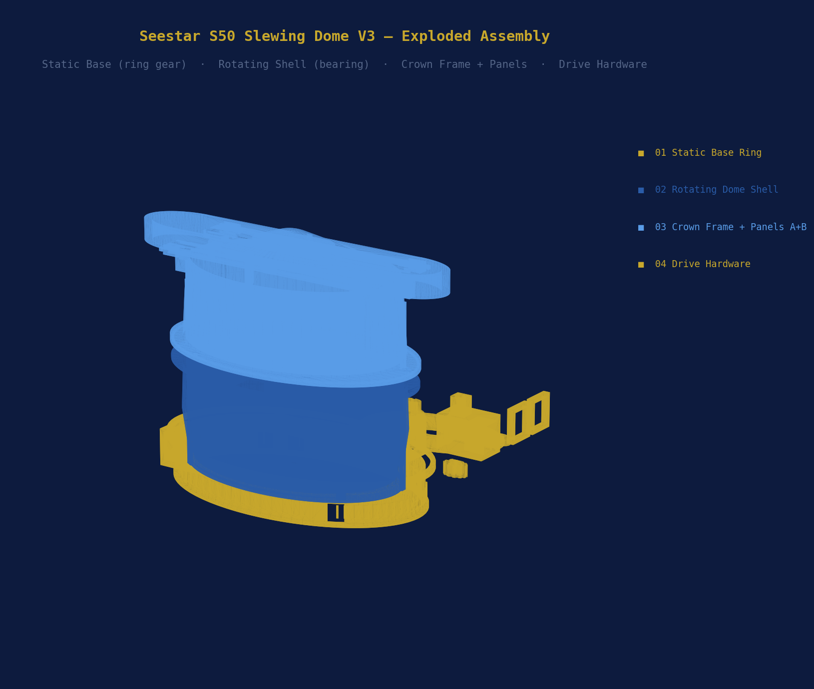
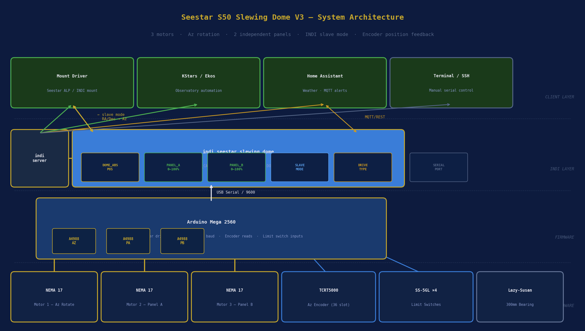
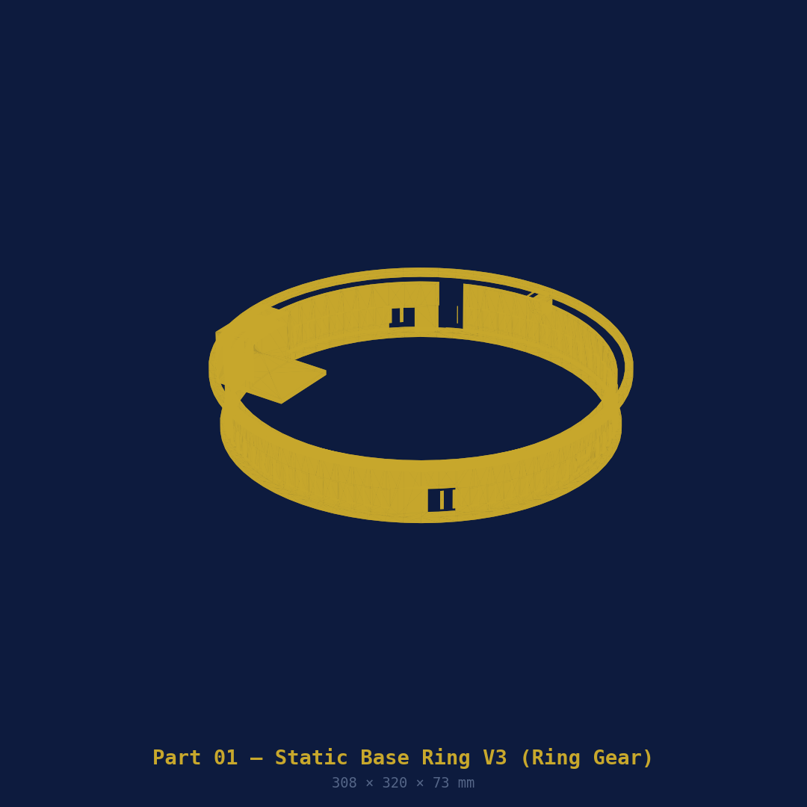
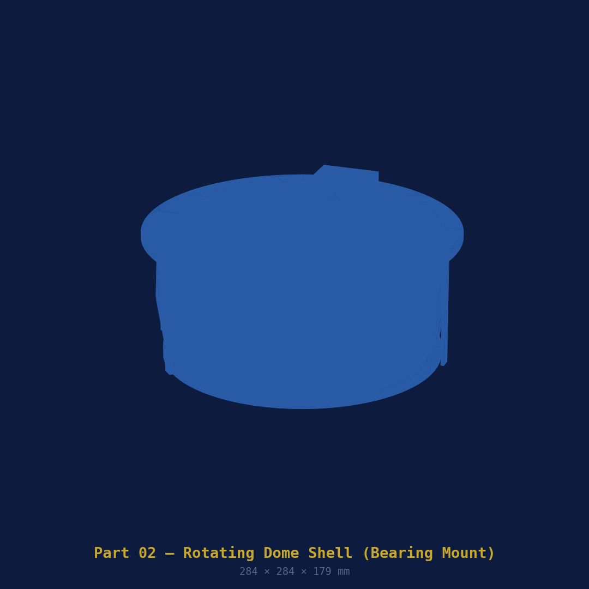
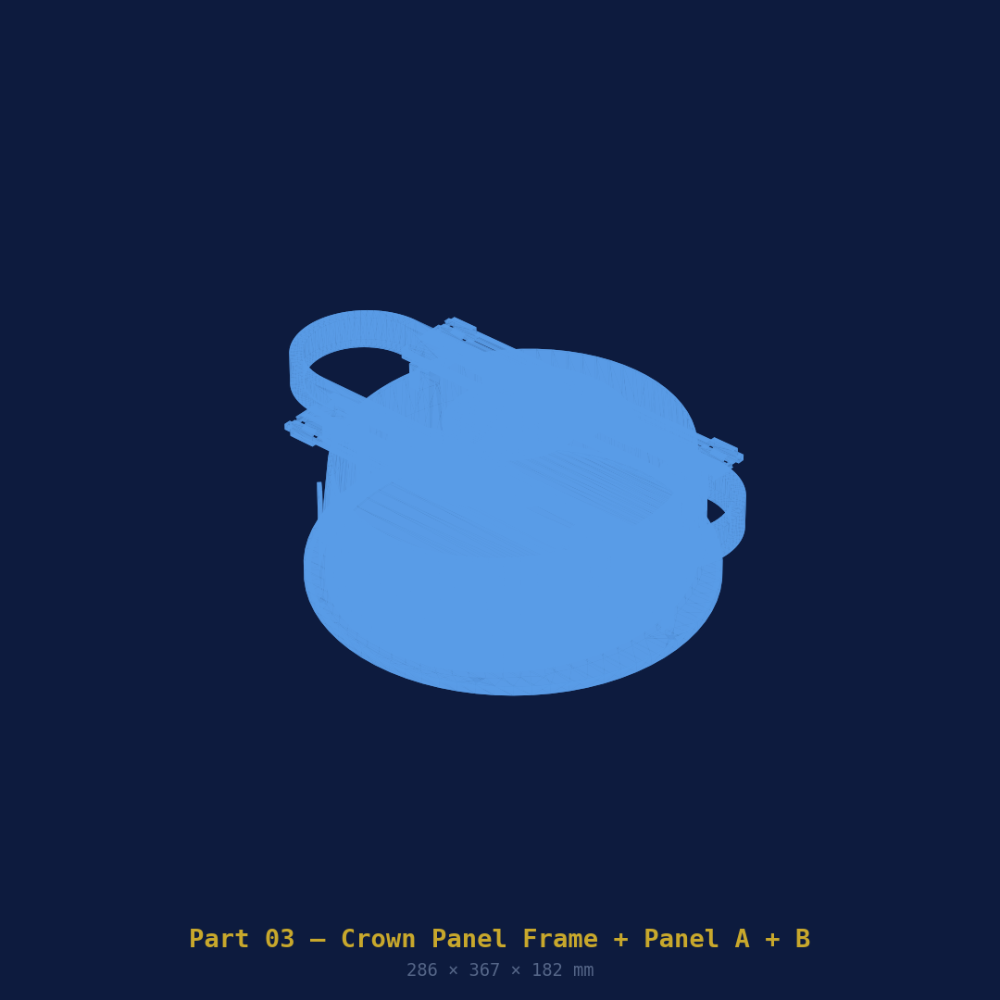
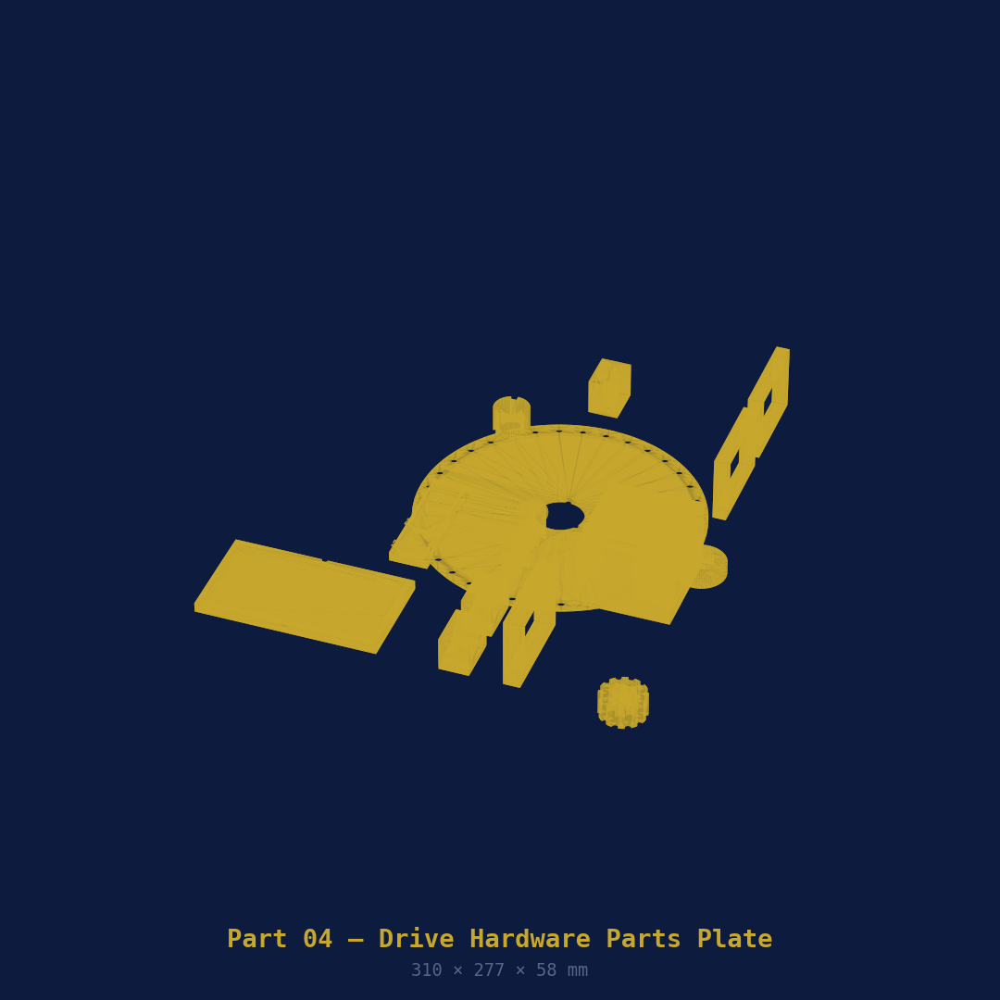

# V3 Addendum — Slewing Dome with Independent Aperture Panels

> This addendum extends the [main README](../README.md).  
> V3 adds full azimuth rotation and two independently controlled crown panels.

---



---

## What V3 Adds

| Feature | V2 Clamshell | V3 Slewing |
|---------|-------------|------------|
| Dome rotation | Static | Full 360° Az rotation |
| Aperture control | One motor opens full lid | Two independent panels (0–100%) |
| Wind shielding | None | Closed side always faces wind |
| Motors | 1 | 3 (Az + Panel A + Panel B) |
| Controller | Arduino Nano | Arduino Mega 2560 |
| Az feedback | None | TCRT5000 IR encoder, 36-slot disk |
| INDI slave mode | No | Yes — dome tracks scope Az automatically |
| Drive options | Lead screw | Ring gear + pinion OR friction wheel |

---

## How It Works

The dome shell sits on a **300 mm lazy-susan bearing** and rotates freely over the static base ring. A NEMA 17 motor (Motor 1) drives the dome in azimuth — either via a **printed ring gear + pinion** (72:12 = 6:1 ratio, 0.0375°/step resolution) or a **rubber friction wheel** pressing on the smooth outer rim. Both drive options are included in the files; choose at assembly time.

At the crown, two sliding panels (Panel A left, Panel B right) move independently on 8 mm guide rods driven by M6 × 1.0 mm lead screws (Motor 2 and Motor 3). Each panel can be positioned from fully closed to fully open (85 mm travel). This lets you dial in exactly how wide the aperture is and which side is shielded.

In INDI slave mode the driver reads the mount's RA/Dec every 5 seconds (configurable), converts to azimuth, and slews the dome to keep the open gap aligned with the scope. The 2° dead-band (configurable) prevents hunting on minor mount movements.

---

## System Architecture



| Layer | Component | Role |
|-------|-----------|------|
| **Hardware** | 3× NEMA 17 + 3× A4988 + TCRT5000 + 4× SS-5GL | Motion + sensing |
| **Firmware** | Arduino Mega 2560 (`dome_controller_v3.ino`) | Serial command interface |
| **INDI** | `indi_seestar_slewing_dome` | Full slewing dome driver |
| **Client** | KStars/Ekos + Seestar ALP + HA | Control, slave mode, weather |

---

## Printed Parts

### Part 01 — Static Base Ring V3



Sits on the tripod or EQ extension (from V2 — fully compatible). Does not rotate.  
Contains the ring gear (72 teeth, module 2) on its outer rim for pinion drive, a smooth outer rail for friction drive, the Az motor pocket, the Az encoder IR sensor bracket, and an enlarged electronics bay (Arduino Mega 2560 + 3× A4988).

| Property | Value |
|----------|-------|
| File | `openscad/01_base_ring.scad` |
| 3MF | `3mf/01_base_ring.3mf` |
| Outer diameter | ~314 mm + gear teeth |
| Est. print time | ~7 h |
| Filament | ~260 g PETG |
| Orientation | Flat, open top face up |
| Supports | None |
| Bed | 320 × 320 mm — rotate 45° |

---

### Part 02 — Rotating Dome Shell V3



This part **rotates** on the lazy-susan bearing. The bearing inner race (240 mm) bolts to the shell underside with 8× M4 bolts. The two panel motors (NEMA 17 #2 and #3) mount on the crown rim and rotate with the shell. The Az encoder disk attaches to the centre hub underneath.

| Property | Value |
|----------|-------|
| File | `openscad/02_dome_lower.scad` |
| 3MF | `3mf/02_dome_lower.3mf` |
| Interior | 252 × 230 mm — scope floats freely |
| Bearing seat | 240 mm ID (lazy-susan inner race) |
| Est. print time | ~11 h |
| Filament | ~330 g PETG |
| Orientation | Flat bottom on plate, interior up |
| Supports | Tree auto |
| Bed | 320 × 320 mm |

---

### Part 03 — Crown Panel Frame + Panel A + Panel B



Three items in one file — export the frame and each panel separately for printing.

The **Crown Frame** bolts to the dome shell top flange and houses the full-length slot, the 8 mm guide rods, and the M6 lead screw bores. **Panel A** (left, Motor 2) and **Panel B** (right, Motor 3) each ride on two LM8UU linear bearings along the guide rods. Each panel has a captured M6 nut with anti-rotation tab. The panels overlap by 10 mm at centre when both are closed.

| Item | Print time | Filament |
|------|------------|---------|
| Crown Frame | ~8 h | ~250 g |
| Panel A | ~2 h | ~70 g |
| Panel B | ~2 h | ~70 g |

| Property | Value |
|----------|-------|
| File | `openscad/03_crown_panels.scad` |
| 3MF | `3mf/03_crown_panels.3mf` |
| Slot width (max open) | 80 mm |
| Panel travel | 85 mm each |
| Guide rods | 8 mm OD × 290 mm (order separately) |
| Linear bearings | LM8UU (order separately) |
| Orientation | Frame: split face down. Panels: flat. |
| Supports | Frame: tree auto. Panels: none. |

---

### Part 04 — Drive Hardware Parts V3



All small parts on one plate. Export by module name for individual printing.

| Sub-part | Qty | Purpose |
|----------|-----|---------|
| Az pinion gear (04a) | 1 | Module 2, 12T — meshes with base ring (pinion drive) |
| Friction wheel mount (04b) | 1 | Holds NEMA 17 + rubber wheel on dome rim |
| Az motor bracket (04c) | 1 | Mounts Az NEMA 17 in base ring rear |
| Panel motor bracket (04d) | 2 | Mounts Panel A+B motors at crown |
| M6 bearing block (04e) | 2 | Lead screw lower end, F626ZZ bearing |
| M6 pivot arm (04f) | 2 | Connects M6 rod to panel |
| Az encoder disk (04g) | 1 | 36-slot, mounts on dome shell underside hub |
| IR sensor bracket (04h) | 1 | Mounts TCRT5000 on base ring, faces disk |
| Arduino Mega tray (04i) | 1 | Snap-fit, electronics bay |
| Triple A4988 tray (04j) | 1 | 3× drivers side by side, labelled AZ/PA/PB |
| Slip-ring spacer (04k) | 1 | Cable management through centre bore |

---

## Additional Hardware (V3 only)

| Item | Qty | AliExpress |
|------|-----|------------|
| 300 mm lazy-susan bearing | 1 | [🔗 Search](https://www.aliexpress.com/w/wholesale-300mm-lazy-susan-bearing-turntable.html) |
| 8 mm OD smooth rod, 300 mm (guide rods) | 2 | [🔗 Search](https://www.aliexpress.com/w/wholesale-8mm-smooth-rod-300mm-linear.html) |
| LM8UU linear bearing | 4 | [🔗 Search](https://www.aliexpress.com/w/wholesale-lm8uu-linear-bearing.html) |
| M6 × 1.0 threaded rod, 150 mm (×2) | 2 | [🔗 Search](https://www.aliexpress.com/w/wholesale-m6-threaded-rod-150mm-stainless.html) |
| F626ZZ flanged bearing (6×19×6) | 2 | [🔗 Search](https://www.aliexpress.com/w/wholesale-f626zz-flanged-bearing.html) |
| M6 flexible shaft coupler 5 mm→6 mm | 2 | [🔗 Search](https://www.aliexpress.com/w/wholesale-flexible-shaft-coupler-5mm-6mm.html) |
| NEMA 17 stepper motor (×3 total) | 3 | [🔗 Search](https://www.aliexpress.com/w/wholesale-nema-17-stepper-motor-40mm.html) |
| A4988 stepper driver with heatsink (×3) | 3 | [🔗 Search](https://www.aliexpress.com/w/wholesale-a4988-stepper-driver-heatsink.html) |
| Arduino Mega 2560 | 1 | [🔗 Search](https://www.aliexpress.com/w/wholesale-arduino-mega-2560-ch340.html) |
| TCRT5000 IR reflective sensor | 1 | [🔗 Search](https://www.aliexpress.com/w/wholesale-tcrt5000-ir-reflective-sensor.html) |
| Omron SS-5GL micro-switch (×4 total) | 4 | [🔗 Search](https://www.aliexpress.com/w/wholesale-omron-ss-5gl-micro-switch.html) |
| 30 mm rubber wheel (friction drive) | 1 | [🔗 Search](https://www.aliexpress.com/w/wholesale-30mm-rubber-wheel-shaft.html) |
| 6-wire slip ring, 12 mm OD | 1 | [🔗 Search](https://www.aliexpress.com/w/wholesale-6-wire-slip-ring-12mm.html) |

> **Slip ring note:** The 6-wire slip ring routes the panel motor wires (6 wires: coil A+B for Motor 2, coil A+B for Motor 3, plus 2 limit switch wires) through the dome centre bore as it rotates. You can omit it if you have sufficient cable slack for 360° rotation without a slip ring — 500 mm of extra cable on each wire is usually enough for a dome that only ever sweeps ±180°.

---

## Firmware

Source: [`firmware/dome_controller_v3/dome_controller_v3.ino`](firmware/dome_controller_v3/dome_controller_v3.ino)

**Target:** Arduino Mega 2560 (not Nano — needs 11 digital outputs for 3× motor drivers)

### Serial Command Reference

| Command | Response | Description |
|---------|----------|-------------|
| `GOTO ddd.d` | `SLEWING:ddd.d` → `AZ_DONE:ddd.d` | Slew to azimuth |
| `SYNC ddd.d` | `SYNCED:ddd.d` | Set current position |
| `STATUS` | `AZ:ddd.d PA:nn PB:nn MOVING:n` | Full status |
| `STOP` / `ABORT` | `STOPPED` | Halt all motors |
| `PA OPEN` | `PA_DONE:136000` | Panel A fully open |
| `PA CLOSE` | `PA_DONE:0` | Panel A fully closed |
| `PA POS nn` | `PA_DONE:nnnnnn` | Panel A to nn% |
| `PB OPEN` | `PB_DONE:136000` | Panel B fully open |
| `PB CLOSE` | `PB_DONE:0` | Panel B fully closed |
| `PB POS nn` | `PB_DONE:nnnnnn` | Panel B to nn% |
| `PANELS OPEN` | `PANELS_OPEN` | Both panels fully open |
| `PANELS CLOSE` | `PANELS_CLOSED` | Both panels closed |
| `PARK` | `PARKED` | Close panels, slew to Az 0° |
| `HOME` | `HOMED` / `HOME_FAILED` | Home encoder on slot transition |

### Upload

```bash
arduino-cli core install arduino:avr
arduino-cli compile --fqbn arduino:avr:mega \
  firmware/dome_controller_v3/dome_controller_v3.ino
arduino-cli upload -p /dev/ttyUSB0 --fqbn arduino:avr:mega \
  firmware/dome_controller_v3/dome_controller_v3.ino
```

---

## INDI Driver

Source: [`indi/seestar_slewing_dome.cpp`](indi/seestar_slewing_dome.cpp)

Appears in KStars/Ekos as **"Seestar Slewing Dome"**.

### Build

```bash
sudo apt install libindi-dev libnova-dev cmake build-essential
cd indi && mkdir build && cd build
cmake -DCMAKE_INSTALL_PREFIX=/usr ..
make -j4 && sudo make install
indiserver -v indi_seestar_slewing_dome
```

### INDI Properties

| Property | Tab | Type | Description |
|----------|-----|------|-------------|
| `DOME_ABSOLUTE_POSITION` | Main | Number | Current / target Az (0–359.9°) |
| `PANEL_A` | Main | Number | Panel A position (0–100%) |
| `PANEL_B` | Main | Number | Panel B position (0–100%) |
| `DOME_SHUTTER` | Main | Switch | Open = PANELS OPEN, Close = PANELS CLOSE |
| `SLAVE_MODE` | Options | Switch | Slave on/off |
| `SLAVE_SETTINGS` | Options | Number | Update interval (s) + dead-band (°) |
| `DRIVE_TYPE` | Options | Switch | Pinion or friction drive |
| `SERIAL_PORT` | Options | Text | Serial port (default /dev/ttyUSB0) |

### Slave Mode Setup in Ekos

1. Load mount driver (Seestar ALP or StellarMate Seestar)
2. Load `indi_seestar_slewing_dome`
3. In Ekos → Observatory → Dome → set **Active telescope** to your mount
4. On driver Options tab → Slave Mode → **Active**
5. Set Update interval (default 5 s) and Dead-band (default 2°)
6. Dome will now track scope azimuth automatically

---

## Assembly Notes (V3 specific)

### Rotation Drive — Pinion Option

1. Press Az pinion (04a) onto NEMA 17 shaft, D-flat aligned — set screw M3
2. Mount Az motor bracket (04c) in base ring rear pocket
3. Position motor so pinion teeth mesh cleanly with ring gear — 0.1–0.2 mm backlash
4. Secure bracket; verify dome rotates smoothly under hand pressure

### Rotation Drive — Friction Wheel Option

1. Press 30 mm rubber wheel onto NEMA 17 shaft
2. Mount friction wheel bracket (04b) — adjust radial slot for firm contact with dome rim
3. Tighten when wheel compresses ~1 mm into dome outer surface

### Lazy-Susan Bearing

1. Place bearing outer race into base ring top face recess (300 mm bore)
2. Lower rotating dome shell onto bearing — inner race rests in shell underside seat
3. 8× M4 × 12 bolts through shell underside flange into inner race — snug evenly
4. Dome should rotate with light hand force and no lateral wobble

### Crown Panel Guide Rods

1. Insert 8 mm guide rods through frame front bore → panel LM8UU bearings → rear bore
2. Rods should be a light press fit in the frame bores — epoxy if loose
3. Insert M6 lead screw through bearing block, through panel nut trap, couple to motor

### Az Encoder

1. Snap encoder disk (04g) onto dome shell underside hub — M3 × 6 screws × 3
2. Mount IR sensor bracket (04h) on base ring rim, align sensor to disk face
3. Gap: 2–5 mm between sensor and disk
4. Test: rotate dome by hand — `analogRead(A0)` should alternate HIGH/LOW 36× per revolution

### Commissioning Checklist

- [ ] Dome rotates freely on bearing — hand-push, no binding
- [ ] `HOME` command completes — encoder transitions detected
- [ ] `GOTO 90` slews to 90° ± 1° (verify with compass or protractor)
- [ ] `PA POS 50` moves Panel A to approximately half open
- [ ] `PB POS 50` moves Panel B independently
- [ ] `PANELS CLOSE` both panels seat flush, 10 mm centre overlap
- [ ] Slave mode: slew mount 10°, dome follows within 5 s
- [ ] `PARK` closes panels and slews to Az 0°
- [ ] Foam seals on panel edges compress evenly

---

*Part of the [SmartScopeAutomatedDome](https://github.com/neilmanfredit/SmartScopeAutomatedDome) project.*  
*Built by [@neilmanfredit](https://github.com/neilmanfredit)*
